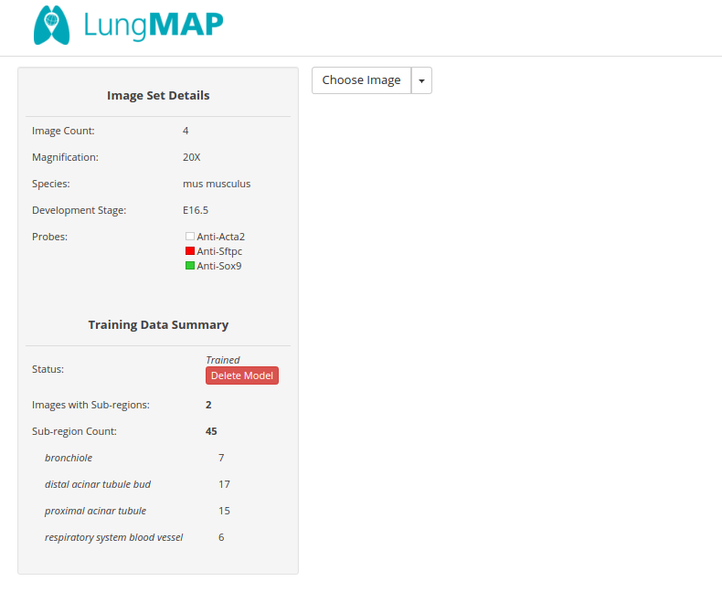

# User Interface Instructions

Welcome to `ihc-image-analysis`, web application for analyzing immuno-histochemistry images data found within the LungMAP repository.
The following instructions provide additional details to the use of our application. Specifically,

1. [Choosing an Image Set](#choosing-an-imageset)
1. [Side Panel](#side-panel)
1. [Image Set List](#image-set-list)
1. [Image Set Detail](#image-set-detail)
1. [Generating Training Data](#generating-training-data)
1. [Training a Model](#training-a-model)

## Choosing an Image Set

An `Image Set` is a collection of LungMAP images grouped together according to the following four variables:
- Species
- Magnification
- Development Stage
- Probe

These groups of images make up a critical component of the `ihc-image-analysis` application because our solution to 
automatically annotate a given image segmentation relies on strata defined models made up of these four variables.
Our first page provides functionality to filter image sets based on these four variables.

### Side Panel

The `side panel` allows users to filter the list of `Image Sets`. Here is a quick overview of the side panel:

To utilize the side panel to narrow the scope of available `ImageSets`, it is important to remember that, within a given variable, the chosen
options are combined with `OR` logic, while the different variables are combined using `AND` logic. For example, selecting:
* Species:
  * 'mus musculus'
* Magnification:
  * 100X
  * 40X
* Probe:
  * 'Anti-Abca3'
  * 'Anti-Acta2'

would filter all image sets showing only those with (species='mus musculus') **AND** (magnification='100X' *OR* magnification='40X') **AND** (probe='Anti-Abca3' *OR* probe='Anti-Acta2').

### Image Set List

Once the results have been narrowed sufficiently, a user will want to choose a given image set. Click the `Apply` button to filter the results. Once filtered, results are displayed to the right of the side panel. To navigate to a particular image set, click the `View` link found in the 1st column of the image set list.

## Image Set Detail

Selecting an image set will navigate to the image set detail view, where the images belonging to that image set can be viewed and annotated. The panel on the left-hand side provides details about the image set, including annotation summaries.

 To select an image, click on the `Choose Image` drop-down menu. Click on one of the image names listed to load that image.

The selected image will load. **Note:** The first time an image is loaded the web application will begin retrieving the image from the LungMAP repository. This can take a few seconds. Once the image is retrieved this first time, it will be saved in the IHC application and will load much faster on subsequent requests. When the image is displayed, notice the 2 new buttons above the image: `Train` and `Classify`. These buttons control the mode of the annotation tool and will be described in more detail in the next two sections. By default, the image will load in `Train` mode.

### Generating Training Data

In `Train` mode, additional buttons are available above the loaded image: a drop-down menu `Label
Subregion`, an orange button labelled `Delete Regions`, and a green button labelled `Save Subregions`. To generate training data:

1. From the `Label Subregion` drop-down menu, choose the anatomical structure for which you want to segment.
  * **Note:** If regions for this image & anatomical structure have already been saved, these regions will automatically appear.
1. To begin segmenting a new region, `left-click` anywhere around the region of interest.
1. Continue to left-click around the segment until it is completely encapsulated. **Note:** The "active" region is the one currently being drawn and is indicated by the presence of rectangular "handles" displayed over each vertex.
1. Once finished segmenting the active region, hit the `Enter` key to deactivate the region.
1. Now, with no region being active, any new left-click will begin a new region.
1. When finished segmenting regions for a single anatomical structure, click on the `Save Regions` button to save your progress to the server.
1. Continue segmenting regions for each of the anatomical structures, as well as any other images in the image set, remembering to save your progress for each structure.

While segmenting an active region, any vertex of of the polygon can be moved by a click-and-drag within the rectangular "handle" around the vertex. A vertex can be deleted using the right mouse click while hovering over its handle. An entire region can be deleted by a right mouse click while hovering over the inside of the polygon.

All the regions for the currently viewed image and anatomical structure can be deleted by clicking on the orange `Delete Regions` button.

#### **Note: You must click on the green `Save Regions` button to save the new regions that have been drawn. New regions are not automatically saved to the database.**

### Training a Model

Once enough regions for each anatomical structure have been segmented, a model can be trained and subsequently used for classifying new regions of interest. The minimum number of regions per structure is 4, and at least 2 different structure classes must have regions. However, using this few regions will not produce a robust model. It is recommended to have at least 10 regions per structure, and creating more than around 20 will begin to have diminishing returns.

To train a model, simply click on the green `Train Model` button on the left-hand side panel. Depending on the number of sub-regions drawn it may take a few minutes for the server to generate the model. When complete, the status will be updated in the `Training Data Summary`.

#### **Note: Once an image set has been trained, the saved sub-regions can no longer be modified. To modify the saved regions, first delete the trained model by clicking on the `Delete Model` button.**